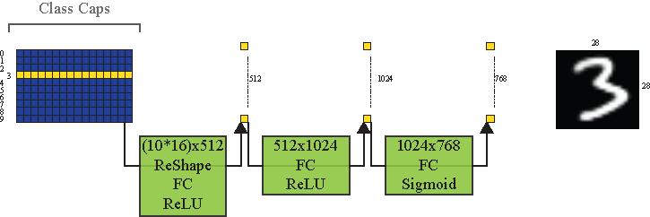

# Houses and Boats: A Toy Dataset to Explore Capsule Networks
## CapsNet
Capsule networks were introduced by Hinton and colleagues in the 2011 paper 
*Transforming Auto-Encoders*. The idea was to replace scalar nodes in neural networks with
capsules (vectors). In 2017, Sabour and colleagues introduced a simple architecture called **CapsNet**
and introduced a Routing Algorithm which enabled the training of neural networks with capsule layers.
Besides introducing two toy datasets (see below), we implement a flexible CapsNet 
model based on the architecture given in the above referenced 2017 paper.

The CapsNet architecture is a 3-layer neural network. The first layer is a Conv2d layer, the second
layer is a capsule layer (PrimaryCaps) and the final layer, ClassCaps (DigitCaps in the paper) is also
a capsule layer.

The main magic happens between the PrimaryCaps layer and the Class Caps layer.
Each capsule in PrimaryCaps is multiplied by a matrix to get the ClassCaps Priors.
Then a routing algorithm forwards information to the capsules in ClassCaps based on
agreement. Initially, all the capsules in PrimaryCaps contribute equally to the capsules 
in ClassCaps. In each subsequent iteration, the contribution of each capsule in PrimaryCaps
is adjusted.

 

## House and Boats Datasets
We introduce two datasets "Houses and Boats" ('./data/HB') and "Houses and Boats Colored" 
('./data/HB_Colored'). The goal of these this project, via these datasets, is to understand how
capsule networks learn the instantiating parameters of the objects detected in the input image.

 
 
 